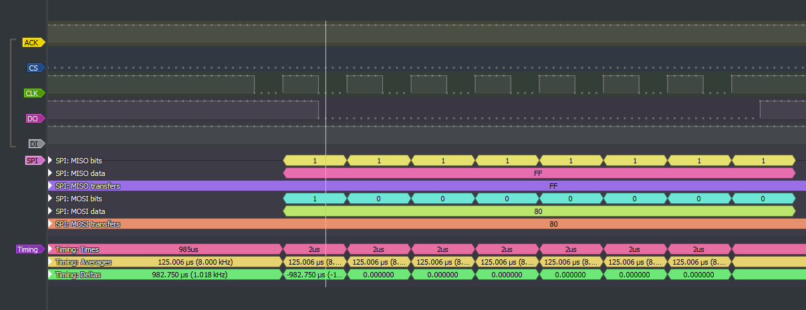
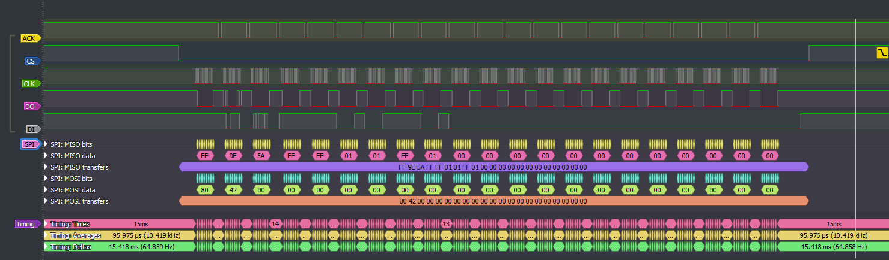
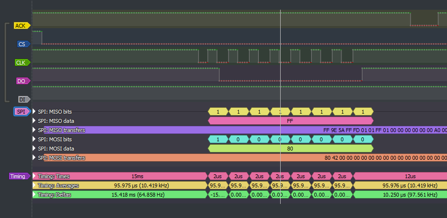

# HAMA Thunder V5 internal protocol everse engineering

In fact, that I only want to use the steering wheel itself, with it's buttons and vibratioio motors, I wanted to rebuild rhe baseboard in the wheel
to just use the internaöl SPI protocol to save a lot of port expanders :D

There are 6 lines for the protocol +power spply (+5V +3,3V, GND). Fortunately, all pins are clearly marked ;-)

ACK
CLK
CS
DO
DI

Hoping that this may be an "standard" SPI bus, I hooked up a Logic Analyzer

As seen here, it seems as normal, as it can be. In this case, the subboard with all buttons is not connected, only the "mainboard" and connected to USB.

Clock frequency is 500 KHz, and SPI mode looks like Mode 3 (CPOL 1:CPHA 1). Without connecting the "subboard", the ACK line is not triggered and the mainboard sends 0x80 continously to startup the transfer. Testing, if the clock rate should be fixed will be tested, when trying  to replace the mainboard.

Seen here in detail the ACK is pulled from the sub after a complete byte transfer. /CS is kept low until 21 Byte cycles (and 21 ACKs)

